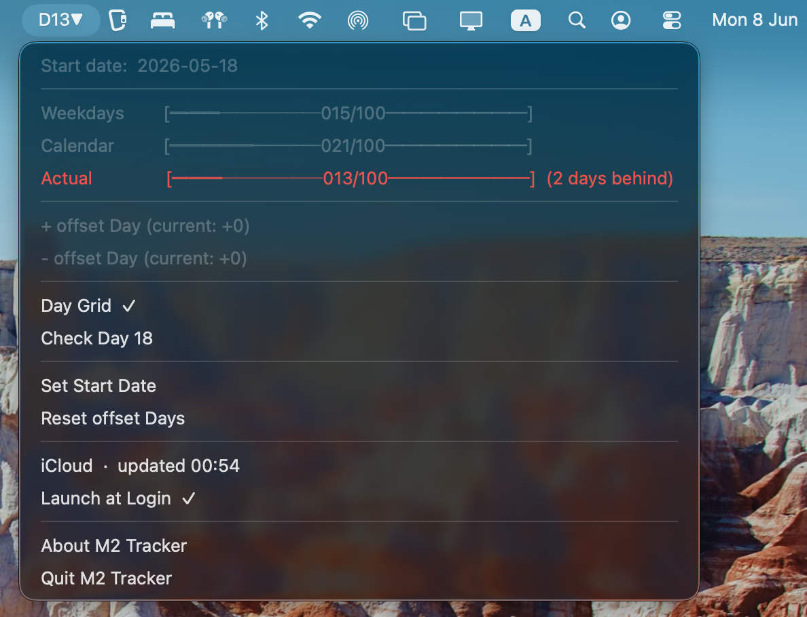

# M2 Tracker
<table>
<tr>
<td width="120">


</td>
<td>

A lightweight macOS menu bar app for tracking progress through the German **100-Day M2 study plan**.

The app displays your current study day directly in the menu bar and helps you stay on track throughout M2 preparation.

</td>
</tr>
</table>

## Table of Contents

- [Features](#features)
- [How It Works](#how-it-works)
  - [Default Tracking](#default-tracking)
  - [Detailed Tracking](#detailed-tracking)
  - [Day Grid](#day-grid)
- [Installation](#installation)
- [Configuration](#configuration)
- [Privacy](#privacy)
- [Requirements](#requirements)
- [Author](#author)
- [License](#license)

---

## What It Does

M2 Tracker calculates your current position within the 100-day study schedule and provides a quick overview of your progress.

Example menu bar display:

```text
D42
```

If you are ahead or behind schedule:

```text
D42▲
```
```text
D42▼
```

Progress overview:

```text
Weekdays      [══════────042/100──────────]
Calendar      [════════──051/100──────────]
Actual        [══════────045/100──────────] (3 days ahead)
```

<br>

<p align="left">
    
</p>

---

## Features

* Native macOS menu bar application
* 100-day M2 progress tracking
* Start date selection with calendar picker
* Automatic weekday calculation
* Calendar-day calculation
* Manual offset adjustment
* Visual progress bars
* Optional detailed day-by-day tracking grid
* Batch import of existing progress
* Local configuration storage
* No accounts
* No subscriptions
* No internet connection required

---

## How It Works

### Default Tracking

Choose a start date.

M2 Tracker automatically calculates:

* Days elapsed
* Weekdays elapsed
* Current study day

The current day is calculated as:

```text
Current Day = Weekdays + Offset
```

Example:

```text
Start Date: 2026-01-01
Weekdays Completed: 40
Offset: +2

Current Day = 42
```

Offsets are useful when:

* You completed multiple study days in one day
* You skipped days
* Your study plan differs from the standard schedule

---

### Detailed Tracking

Instead of using weekday calculations, M2 Tracker can calculate progress from actual completed study days.

Enable **Day Grid** mode and track each study day individually.

Each day contains three tasks:

```text
🔵 AMBOSS Articles
🟢 IMPP Questions
🟣 further studying (e.g. Anki)
```

A day counts as completed only when all three tasks are marked complete.

The current study day becomes:

```text
Current Day = Completed Days
```

This allows tracking based on actual work completed rather than calendar progression.

* `Batch Edit` allows you to select how many days have been studied before and check all the boxes up to the chosen day for easier use.
* `Clear All` button lets you reset the current progress.

### Day Grid

<p align="left">
    
</p>

---

## Installation

### Download Release

1. Download the latest `.dmg` from the [Releases page](https://github.com/SpikeMurphy/M2Tracker/releases/tag/v0.0.3).
2. Open the downloaded DMG.
3. Drag **M2 Tracker.app** into the **Applications** folder.
4. Launch the application.

macOS may require confirmation the first time the app is opened.

---

## Configuration

Settings are stored locally in:

```text
~/.m2_tracker_config.json
```

Example:

```json
{
  "start_date": "2026-01-01",
  "offset_days": 2,
  "use_grid": true,
  "grid": {}
}
```

Stored values include:

* Start date
* Offset days
* Grid tracking state
* Day completion data

Deleting this file resets the application.

---

## Privacy

M2 Tracker does not:

* Collect data
* Use analytics
* Contact external servers
* Require an account
* Upload information anywhere

All data remains on your device.

---

## Requirements

* macOS
* Apple Silicon or Intel Mac
* macOS 12 or newer (recommended)

---

## Author

Spike Murphy Müller

---

## License

[MIT License](https://github.com/SpikeMurphy/M2Tracker/blob/main/LICENSE.md)