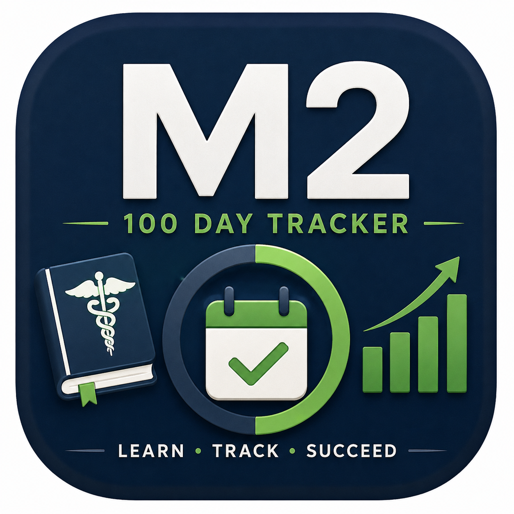
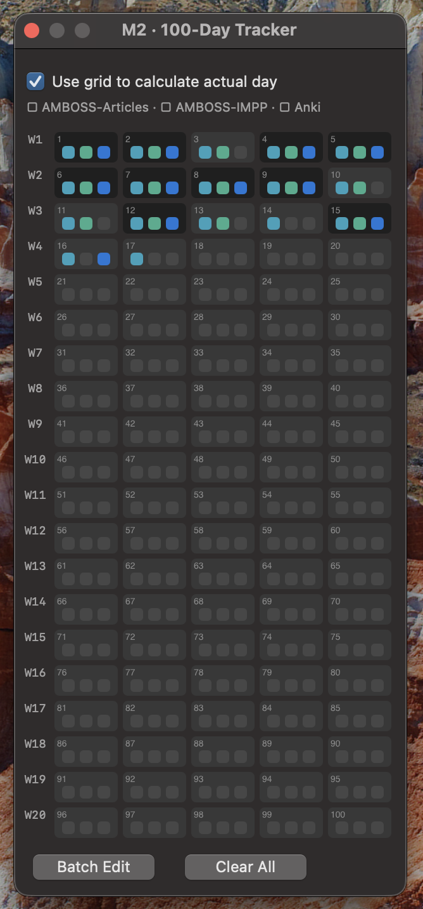

# M2 Tracker

<table>
<tr>
<td width="120">

</td>
<td>
A lightweight macOS menu bar app for tracking your progress through the German <strong>100-Day M2 study plan</strong>.<br><br>
No accounts. No subscriptions. No internet required. Just your progress, always one glance away.
</td>
</tr>
</table>

> **Disclaimer:** M2 Tracker is provided as-is and has not been extensively tested across all macOS versions and configurations. Use it as a helpful companion, but always keep your own notes as a backup. Bug reports and feedback are welcome.

---

## Table of Contents

- [What It Does](#what-it-does)
- [Installation](#installation)
- [First Launch Setup](#first-launch-setup)
- [How to Use](#how-to-use)
  - [Default Tracking](#default-tracking)
  - [Grid Tracking](#grid-tracking)
  - [Offset Adjustment](#offset-adjustment)
- [iCloud Sync](#icloud-sync)
- [Launch at Login](#launch-at-login)
- [Tips & Troubleshooting](#tips--troubleshooting)
- [Configuration](#configuration)
- [Privacy](#privacy)
- [Requirements](#requirements)
- [Author](#author)
- [License](#license)

---

## What It Does

M2 Tracker sits in your menu bar and shows your current position in the 100-day M2 study plan at a glance.

```
D42▲
```

The number is your current study day. The arrow tells you whether you're ahead (▲) or behind (▼) the weekday schedule. No arrow means you're exactly on track.

Opening the menu gives you a full progress overview:

```
Weekdays      [══════════042/100──────────]
Calendar      [════════──051/100──────────]
Actual        [══════════045/100──────────]  (3 days ahead)
```

- **Weekdays** — how many weekdays have passed since your start date
- **Calendar** — how many calendar days have passed
- **Actual** — your real study day, based on either weekdays + offset, or your completed grid days

---

## Installation

1. Download the latest `.dmg` from the [Releases page](https://github.com/SpikeMurphy/M2Tracker/releases).
2. Open the DMG and drag **M2 Tracker.app** into your **Applications** folder.
3. Launch the app. macOS may ask you to confirm opening it the first time.  
*You might need to open System Settings, Privacy and Security and approve opening the app there*

---

## First Launch Setup

On the very first launch, M2 Tracker asks you two setup questions. These only appear once.

### 1. Storage Location

Choose where your data is saved:

| Option | What it does |
|--------|-------------|
| **iCloud** | Saves to your iCloud Drive (`icloud/M2Tracker/m2_tracker_config.json`) and syncs across all your Macs |
| **Local** | Saves only on this Mac (`~/.m2_tracker_config.json`) |

If you choose **iCloud**, a folder picker will appear asking you to confirm access to the M2Tracker folder in your iCloud Drive. **Click "Allow Access"** — this is required for the app to read and write the file.

### 2. Launch at Login

Choose whether M2 Tracker should start automatically every time you log in. You can change this later from the menu.

### Setting Your Start Date

After setup, open the menu and tap **Set Start Date**. Pick the day you started (or plan to start) your 100-day plan. The app begins tracking from that date.

---

## How to Use

### Default Tracking

The simplest mode. Set your start date and the app does the rest — it counts the weekdays elapsed and displays your current study day automatically.

```
Current Day = Weekdays elapsed + Offset
```

This is the default and works without any manual input beyond the start date.

### Grid Tracking

For more precise tracking based on what you've actually studied (rather than the calendar), enable **Day Grid** from the menu.

<p align="left">
  
</p>

The grid shows all 100 days. Each day has three checkboxes:

| Colour | Task |
|--------|------|
| 🔵 Blue | AMBOSS Articles |
| 🟢 Green | AMBOSS IMPP Questions |
| 🟣 Purple | Further studying (e.g. Anki) |

A day only counts as complete when **all three boxes** are checked. The menu bar number updates to reflect your actually completed days.

**Shortcuts inside the grid:**

- **Batch Edit** — enter a number to mark all days up to that point as fully complete. Useful if you're setting up the app after already having studied several days.
- **Clear All** — resets every checkbox in the grid.
- **Check Day DD** (in the main menu) — marks the next incomplete day as fully done in one click, without opening the grid.

### Offset Adjustment

Sometimes the calendar doesn't match reality — you studied twice in one day, skipped a day, or your personal schedule differs from the standard plan. Offsets let you correct for this.

Use **+ offset Day** and **− offset Day** in the menu to shift your actual day up or down. The current offset is always shown next to the button.

Offsets are disabled when Grid mode is active (the grid itself becomes the source of truth).

---

## iCloud Sync

When iCloud storage is enabled, M2 Tracker checks the config file every **60 seconds** and updates the display if it detects a change from another device.

### How syncing works

1. You make a change on Mac A → the config file is written to iCloud Drive with a timestamp.
2. Within 60 seconds on Mac B → M2 Tracker detects the newer timestamp and reloads the config.
3. Mac B's display updates to reflect the change.

### Important: the 60-second window

> [!WARNING]
> **After making changes on one Mac, wait at least 60 seconds before using the other Mac.**

If you edit on both Macs within the same 60-second window, the second write will overwrite the first. There is no conflict resolution — last write wins.

### Setting up iCloud on a second Mac

The iCloud config file is shared, but each Mac needs to be granted access to the iCloud folder independently.

1. Install and launch M2 Tracker on the second Mac.
2. When asked about storage, choose **iCloud**.
3. When the folder picker appears, click **Allow Access** — do not cancel or skip this step.
4. The app will find the existing config file and load your progress automatically.

### Switching between Local and iCloud

Tap the storage button in the menu (it shows either **iCloud · updated HH:MM** or **Local · updated HH:MM**). You'll be asked to confirm, and your existing data will be copied to the new location automatically.

---

## Launch at Login

The menu shows either **Launch at Login ✓** (enabled) or **Launch at Login** (disabled). Tap it to toggle. The checkmark updates immediately.

---

## Tips & Troubleshooting

**The app shows "Waiting for iCloud sync…" instead of my data**

The iCloud folder permission was likely not granted. Fix it by switching storage mode:

1. Open the menu → tap the **iCloud · updated…** button
2. Confirm switching to **Local**
3. Tap it again and switch back to **iCloud**
4. When the folder picker appears, click **Allow Access**

The app will reload your config and display your progress.

---

**I accidentally dismissed the folder picker without clicking Allow Access**

Same fix as above — switch to Local and back to iCloud. The picker will appear again and you can grant access properly.

---

**The menu bar shows D0 or the wrong day after switching Macs**

Wait 60 seconds. The sync check runs on a 60-second interval. If it still doesn't update, quit and relaunch the app — it re-reads the config on startup.

---

**The app doesn't open after a macOS update or on a new Mac**

macOS may block apps downloaded from the internet. Right-click **M2 Tracker.app** → **Open** → confirm in the dialog. You only need to do this once.  
*You might need to open System Settings, Privacy and Security and approve opening the app there*

---

**Can I reset everything and start fresh?**

Delete the config file for your storage mode:

- **Local:** `~/.m2_tracker_config.json`
- **iCloud:** `~/Library/CloudStorage/iCloud Drive/M2Tracker/m2_tracker_config.json`

Relaunch the app and go through setup again.

---

**I want to move my data from Local to iCloud (or vice versa)**

Just tap the storage button in the menu and switch — M2 Tracker copies your config to the new location automatically.

---

## Configuration

M2 Tracker stores two files locally, both as plain JSON:

| File | Purpose |
|------|---------|
| `~/.m2_tracker_prefs.json` | Your storage choice and login preference — always local, never synced |
| `~/.m2_tracker_config.json` | Your progress data (if using Local storage) |
| `iCloud Drive/M2Tracker/m2_tracker_config.json` | Your progress data (if using iCloud storage) |

Example config:

```json
{
  "start_date": "2026-01-01",
  "offset_days": 2,
  "use_grid": true,
  "grid": {},
  "updated_at": "2026-06-08 14:23:00"
}
```

You can edit this file manually if needed. Deleting it resets the app to its initial state (but your prefs file is kept, so you won't be asked setup questions again).

---

## Privacy

M2 Tracker does not collect data, use analytics, contact external servers, or require an account. Nothing leaves your device except what you choose to sync via your own iCloud account.

---

## Requirements

- macOS 12 or newer (recommended)
- Apple Silicon or Intel Mac
- iCloud Drive enabled (only if using iCloud sync)

---

## Author

Spike Murphy Müller

---

## License

[MIT License](https://github.com/SpikeMurphy/M2Tracker/blob/main/LICENSE.md)